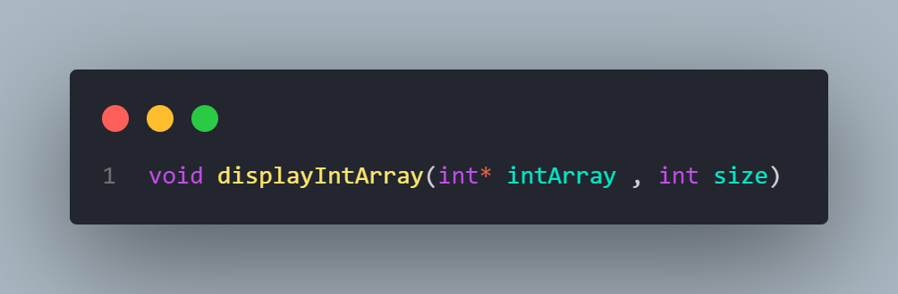

# Binary Translator

This project aims translates groups of 8-bit strings into their human readable string equivalents following a modular approach .

## 1. Approach

1. Parse Input: Read the binary data as a single string.
2. Split into Substrings: Create a function to split the string by spaces into multiple 8-bit segments.
3. Convert to Decimal: For each binary substring, convert it to decimal by iterating over bits and using powers of two.
4. Convert to Characters (Optional): If desired, convert the decimal values to ASCII characters to form readable text.
5. Print or Display: Write helper functions to show the binary, decimal, or character outputs.

## 2. Functions

-Splits the input string into separate 8-character binary substrings.

- Returns an array of strings and populates `outputSize` with the number of substrings.

 

-Converts each 8-bit binary substring into its decimal representation.

- Returns an array of integers.
  

 

-Converts an array of decimal integers to a single string.

- Returns a dynamically allocated string.

 
 

 
 

 
 

-Helpful functions that print out the results in neatly formatted arrays.

## 3. main

1. the main function above contains 2 binary strings ive included to test and see the program execution , simply compile the main.c file with the src.c file and run the resulting executable.
